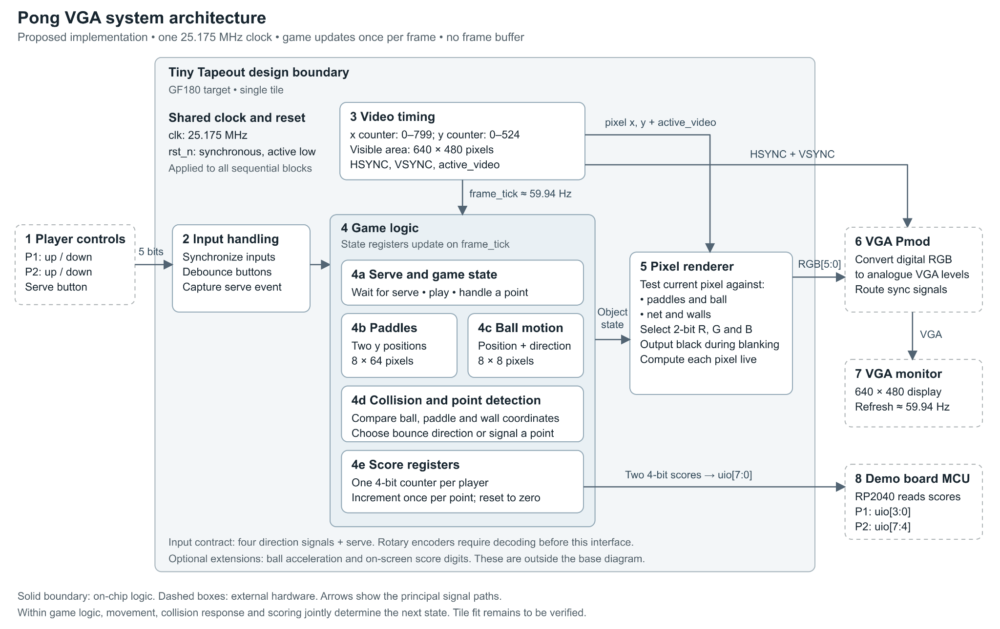
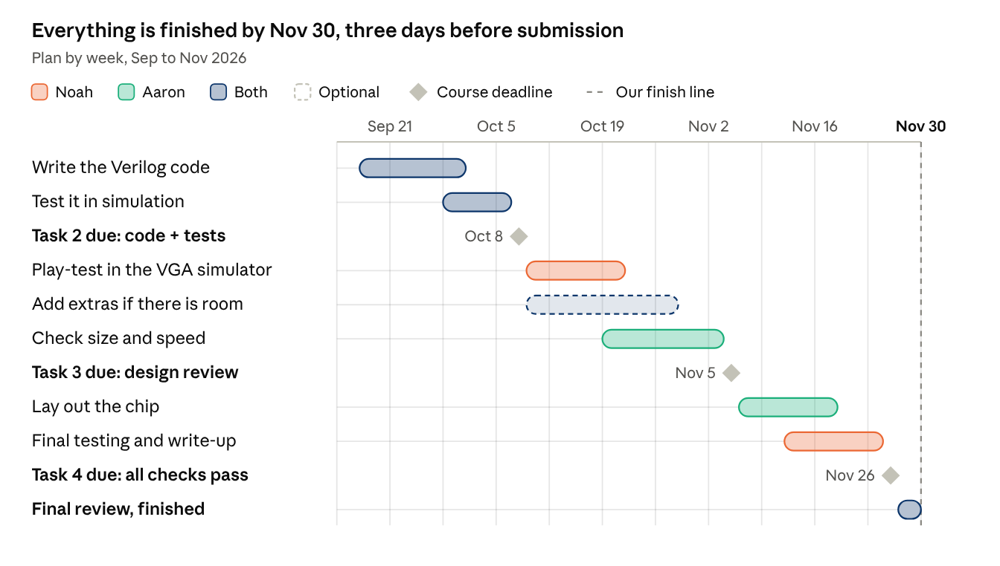

# Pong VGA

A proposed two-player Pong game with a live VGA display, rotary-encoder controls, and hardware game logic.

## Overview

This project aims to build a two-player Pong-style game displayed on a VGA monitor. Two rotary encoders control player movement, with the monitor and supporting hardware connected through a separate PCB.

Planned gameplay includes paddle and wall collisions, a serve button, and player scores from 0 to 10. Ball acceleration and additional collision-angle behaviour are optional extensions, depending on the transistor budget remaining after the main game logic is implemented.

## System Architecture

The proposed architecture uses a single 25.175 MHz clock, updates the game once per frame, and renders pixels without a frame buffer.

## I/O Pin Assignments

| Pin | Direction | Signal |
| --- | --- | --- |
| `ui_in[0]` / `ui_in[1]` | Input | Player 1 up / down button |
| `ui_in[2]` / `ui_in[3]` | Input | Player 2 up / down button |
| `ui_in[4]` | Input | Serve button |
| `ui_in[7:5]` | Input | Unused |
| `uo_out[0]` / `uo_out[4]` | Output | Red, MSB / LSB (`R1` / `R0`) |
| `uo_out[1]` / `uo_out[5]` | Output | Green, MSB / LSB (`G1` / `G0`) |
| `uo_out[2]` / `uo_out[6]` | Output | Blue, MSB / LSB (`B1` / `B0`) |
| `uo_out[3]` | Output | VSYNC, active low |
| `uo_out[7]` | Output | HSYNC, active low |
| `uio[3:0]` | Output | Player 1 score, 0-10 |
| `uio[7:4]` | Output | Player 2 score, 0-10 |
| `clk` | Input | 25.175 MHz pixel clock |
| `rst_n` | Input | Reset, active low |
| `ena` | Input | Unused; high while this design is selected |

Rotary encoders require decoding into the up/down control signals shown above.

## Proposed Specifications

| Parameter | Specification |
| --- | --- |
| Clock | 25.175 MHz VGA pixel clock |
| Video | VGA, 640 × 480 at approximately 60 Hz |
| Total video timing | 800 × 525 pixels, including blanking intervals |
| Colours | 64 colours, with 2 bits per RGB channel |
| Players | 2 |
| Paddle size | 8 × 64 pixels |
| Ball size | 8 × 8 pixels |
| Collision behaviour | Wall and paddle bounces; the paddle half hit sets the bounce angle |
| Serve | Serve button starts play |
| Scoring | Scores from 0 to 10 for each player |
| Pixel period | Approximately 40 ns |
| Line period | Approximately 32 µs |
| Frame period | Approximately 16.68 ms |
| Frame rate | Approximately 60 frames per second |
| Reset | Synchronous, active-low `rst_n`; clears scores to 0, centres paddles, and parks the ball until serve |
| External hardware | VGA monitor, rotary encoders, and a small MCU, with supporting hardware on a separate PCB |

## Project Timeline

The proposed schedule runs from September to November 2026, with all work planned to finish by **November 30**, three days before submission.

| Milestone | Planned Date |
| --- | --- |
| Task 2: Code and tests | October 8, 2026 |
| Task 3: Design review | November 5, 2026 |
| Task 4: All checks pass | November 26, 2026 |
| Final review and completion | November 30, 2026 |

## Team Responsibilities

| Area | Noah | Aaron |
| --- | --- | --- |
| Design (RTL) | Sync generator and pixel renderer | Game logic |
| Simulation | cocotb tests for sync timing and the renderer | cocotb tests for game logic; gate-level simulation |
| Design checking | Review game-logic RTL and tests | Review sync and renderer RTL and tests |
| Calculations | VGA timing and I/O rates | Transistor budget and timing slack at 50 MHz |
| Layout (GDS) | Documentation, precheck, and final CI run | Hardening runs, DRC/LVS, and extraction |
| Presentation and report | Shared | Shared |
